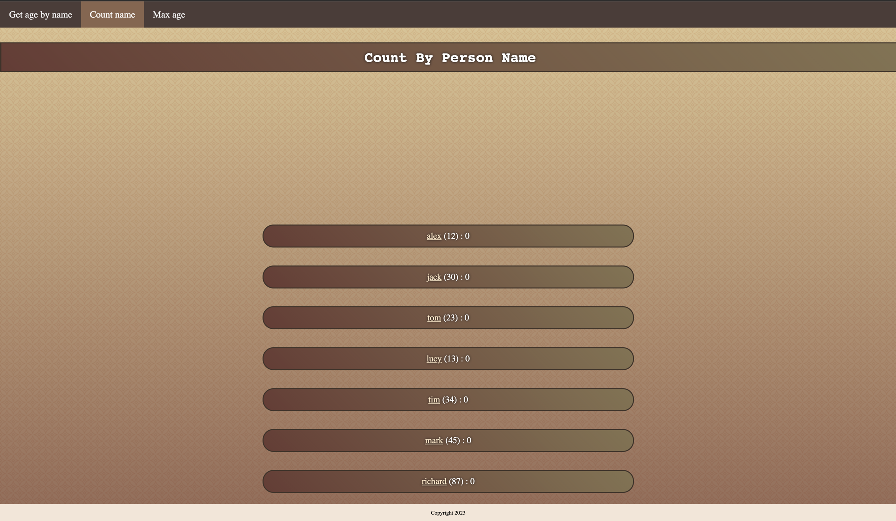
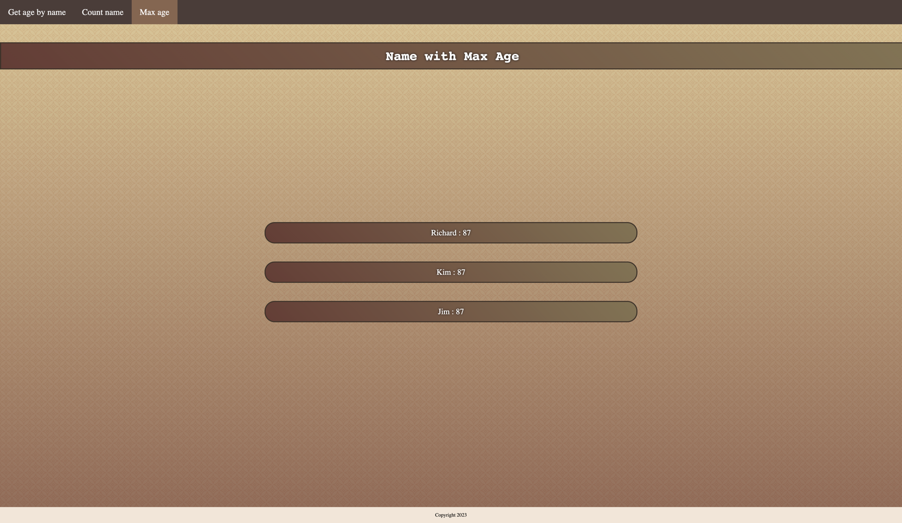

# Тестовое задание в компанию NAUMEN

Сервис для считывания текстового файла и его анализа

## Задание
Создать web-приложение на Java, которое может:
1. Считывать из текстового файла строки формата имя_возраст. Например: Андрей_27
2. Предоставлять веб-интерфейс с полем ввода
   для произвольного имени. После отправки имени на сервер
   в ответ должен прийти возраст, соответствующий этому
   имени. Если имени нет в перечне, то должно возвращаться
   произвольное положительное целое число.
3. Предоставлять возможность ведения просмотра
   статистики запросов по каждому имени:
   - вывод частотности запросов в разрезе имён
   - вывод имени с наибольшим возрастом
4. Приложение будет поддерживать работу с внешним
   сервисом, который будет возвращать возраст произвольных
   имен, если их нет в текстовом файле
## Tech Stack

**Client:** HTML, CSS, Thymeleaf

**Server:** Java, Spring Framework, Hibernate, PostgreSQL, H2 DB


## Environment Variables

To run this project, you will need to add the following environment variables to your .env file

`DB_URL` - url for db

`DB_USERNAME=username` - username for db

`DB_PASSWORD=password` - password for db


## Run Locally

Clone the project

```bash
  git clone https://github.com/greenblat17/naumen-task.git
```

Go to the project directory

```bash
  cd naumen-task
```

Set environment variables

```bash
  export \
  DB_URL=postgresql://host:port/database \
  DB_USERNAME=username \
  DB_PASSWORD=password 
```

Start the server

```bash
  mvn spring-boot:run
```


## Running Tests

To run tests, run the following command

```bash
  mvn clean test
```

## API Reference

#### Get the age of a person by name

```http
  GET localhost:8080/people/search
```

#### Get the frequency of requests in the context of names

```http
  GET localhost:8080/statistics/count?page=${pageNumber}
```

| Parameter | Type     | Description                                                     |
| :-------- | :------- |:----------------------------------------------------------------|
| `pageNumber` | `int` | **Required**. **Default Value = 0**. page number for count page |

#### Get the name with the highest age

```http
  GET localhost:8080/statistics/name-by-max-age?page=${pageNumber}
```

| Parameter | Type     | Description                                                             |
| :-------- | :------- |:------------------------------------------------------------------------|
| `pageNumber` | `int` | **Required**. **Default Value = 0**. page number for names with max age |

#### Get full stats by name

```http
  GET localhost:8080/statistics/full?name=${queryName}
```

| Parameter | Type     | Description                       |
| :-------- | :------- | :-------------------------------- |
| `queryName` | `string` | **Required**. Name for statistics |


## Screenshots





